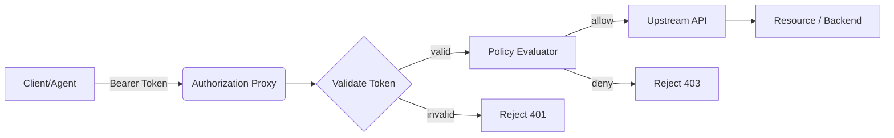

# MCP-Style Authorization — PoC

This repository contains a compact Proof-of-Concept (PoC) demonstrating a minimal authorization layer for agent-mediated APIs.

Purpose
- Experimental code written to validate design ideas around token-based authorization and simple policy evaluation.

Quickstart
- Create a Python 3.11 virtualenv
- Install dependencies: `pip install -r requirements.txt`
- Run: `uvicorn src.main:app --reload`

Tests
- Run unit tests with: `pytest -q`

Token generation (PoC symmetric secret)
- Use `python scripts/gen_token.py` to print a short-lived token for testing

Design diagram (Mermaid)

Notes
- This PoC uses a symmetric JWT secret (`test-secret`) for iteration speed. Replace with environment-based secrets or public-key verification for production.
- Keep the PoC experimental; it is intentionally small so you can adapt it quickly for your use cases.

License
- No license is specified in the PoC; add a license if you plan to publish it publicly.
